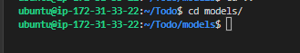
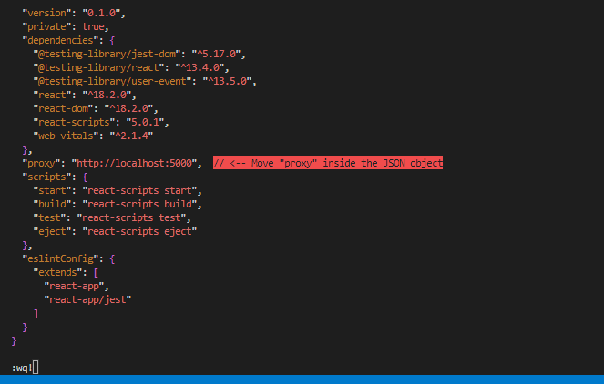
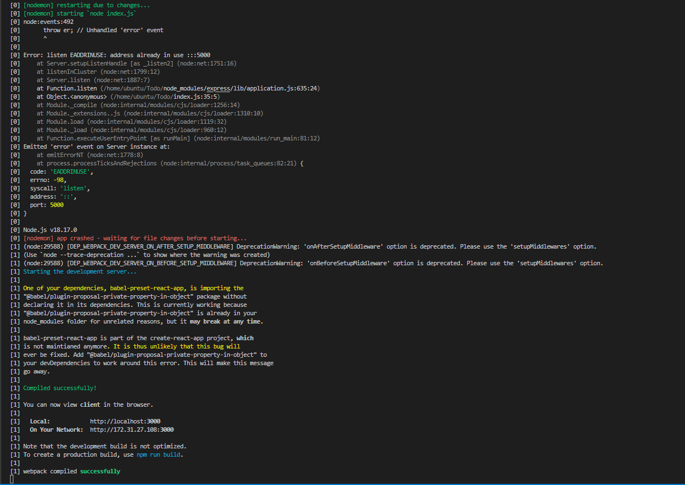

# MERN STACK IMPLEMENTATION

## A SIMPLE TO_DO APPLICATION

BACKEND CONFIGURATION

`sudo apt update`

`sudo apt upgrade`

get the location of Node.js software from Ubuntu repositories

`curl -fsSL https://deb.nodesource.com/setup_18.x | sudo -E bash -`

install nodejs on the server

`sudo apt-get install -y nodejs`

The command above installs both nodejs and npm. NPM is a package manager for Node like apt for Ubuntu, it is used to install Node modules & packages and to manage dependency conflicts

verify node installation

`node -v`

verify node installation

`npm -v`

Application Code Setup
Create a new directory for your To-Do project:

`mkdir Todo`

verify Todo directory has been created

`ls`

change directory to Todo directory

`cd Todo`

Next, you will use the command npm init to initialise your project, so that a new file named package.json will be created. This file will normally contain information about your application and the dependencies that it needs to run. Follow the prompts after running the command. You can press Enter several times to accept default values, then accept to write out the package.json file by typing yes.

`npm init`

Run the command ls to confirm that you have package.json file created

`ls`

### INSTALL expressjs

Remember that Express is a framework for Node.js, therefore a lot of things developers would have programmed is already taken care of out of the box. Therefore it simplifies development, and abstracts a lot of low level details. For example, Express helps to define routes of your application based on HTTP methods and URLs.

`npm install express`

create index.js file

`touch index.js`

`ls`

install the dotenv module

`npm install dotenv`

open index.js file and paste barebones configuration below 

const express = require('express');
require('dotenv').config();

const app = express();

const port = process.env.PORT || 5000;

app.use((req, res, next) => {
res.header("Access-Control-Allow-Origin", "\*");
res.header("Access-Control-Allow-Headers", "Origin, X-Requested-With, Content-Type, Accept");
next();
});

app.use((req, res, next) => {
res.send('Welcome to Express');
});

app.listen(port, () => {
console.log(`Server running on port ${port}`)
});

`vim index.js`

start server to see if it works

`node index.js`

edit inbound rules in AWS console and open port 5000

Open up your browser and try to access your server’s Public IP or Public DNS name followed by port 5000

[opening page in browser](http://3.74.161.53:5000/)

Routes
There are three actions that our To-Do application needs to be able to do:

Create a new task
Display list of all tasks
Delete a completed task
Each task will be associated with some particular endpoint and will use different standard HTTP request methods: POST, GET, DELETE.

For each task, we need to create routes that will define various endpoints that the To-do app will depend on. So let us create a folder routes

`mkdir routes`

change to routes directory

`cd routes`

create a file api.js

`touch api.js`

open api.js file with vim and paste configuration below

const express = require ('express');
const router = express.Router();

router.get('/todos', (req, res, next) => {

});

router.post('/todos', (req, res, next) => {

});

router.delete('/todos/:id', (req, res, next) => {

})

module.exports = router;

`vim api.js`

MODELS

Now comes the interesting part, since the app is going to make use of Mongodb which is a NoSQL database, we need to create a model.

A model is at the heart of JavaScript based applications, and it is what makes it interactive.

We will also use models to define the database schema . This is important so that we will be able to define the fields stored in each Mongodb document. (Seems like a lot of information, but not to worry, everything will become clear to you over time. I promise!!!)

In essence, the Schema is a blueprint of how the database will be constructed, including other data fields that may not be required to be stored in the database. These are known as virtual properties

To create a Schema and a model, install mongoose which is a Node.js package that makes working with mongodb easier.

Change directory back Todo folder with cd .. and install Mongoose

`cd ..`

`npm install mongoose`

create a new folder called models

`mkdir models`

change to models directory

`cd models`

Inside the models folder, create a file and name it todo.js

`touch todo.js`

Open the file created with vim todo.js then paste the code below in the file:

const mongoose = require('mongoose');
const Schema = mongoose.Schema;

//create schema for todo
const TodoSchema = new Schema({
action: {
type: String,
required: [true, 'The todo text field is required']
}
})

//create model for todo
const Todo = mongoose.model('todo', TodoSchema);

module.exports = Todo;

`vim todo.js`

Now we need to update our routes from the file api.js in ‘routes’ directory to make use of the new model.

In Routes directory, open api.js with vim api.js, delete the code inside with :%d command and paste there code below into it then save and exit

const express = require ('express');
const router = express.Router();
const Todo = require('../models/todo');

router.get('/todos', (req, res, next) => {

//this will return all the data, exposing only the id and action field to the client
Todo.find({}, 'action')
.then(data => res.json(data))
.catch(next)
});

router.post('/todos', (req, res, next) => {
if(req.body.action){
Todo.create(req.body)
.then(data => res.json(data))
.catch(next)
}else {
res.json({
error: "The input field is empty"
})
}
});

router.delete('/todos/:id', (req, res, next) => {
Todo.findOneAndDelete({"_id": req.params.id})
.then(data => res.json(data))
.catch(next)
})

module.exports = router;

`vim api.js`

MONGODB DATABASE

We need a database where we will store our data. For this we will make use of mLab. mLab provides MongoDB database as a service solution (DBaaS), so to make life easy, you will need to sign up for a shared clusters free account, which is ideal for our use case. Sign up here. Follow the sign up process, select AWS as the cloud provider, and choose a region near you.

allow access to mongodb database from anywhere (not secure, but ideal for testing) and change time for entry to be deleted from 6 hours to 1 week

In the index.js file, we specified process.env to access environment variables, but we have not yet created this file. So we need to do that now.

Create a file in your Todo directory and name it .env

`touch .env`

Add the connection string to access the database in it, just as below:

DB = 'mongodb+srv://<username>:<password>@<network-address>/<dbname>?retryWrites=true&w=majority'
Ensure to update <username>, <password>, <network-address> and <database> according to your setup

Get your connection string from your mongodb account

first install driver 

`npm install mongodb@4.1`

connection string:   mongodb+srv://iyeredev:<password>@meanstack1.qsrjbff.mongodb.net/?retryWrites=true&w=majority

Replace <password> with the password for the iyeredev user

connection string:   mongodb+srv://iyeredev:<HappyKonga>@meanstack1.qsrjbff.mongodb.net/?retryWrites=true&w=majority

at this point, open .env file and add connection string

Now we need to update the index.js to reflect the use of .env so that Node.js can connect to the database.

Simply delete existing content in the file, and update it with the entire code below:

const express = require('express');
const bodyParser = require('body-parser');
const mongoose = require('mongoose');
const routes = require('./routes/api');
const path = require('path');
require('dotenv').config();

const app = express();

const port = process.env.PORT || 5000;

//connect to the database
mongoose.connect(process.env.DB, { useNewUrlParser: true, useUnifiedTopology: true })
.then(() => console.log(`Database connected successfully`))
.catch(err => console.log(err));

//since mongoose promise is depreciated, we overide it with node's promise
mongoose.Promise = global.Promise;

app.use((req, res, next) => {
res.header("Access-Control-Allow-Origin", "\*");
res.header("Access-Control-Allow-Headers", "Origin, X-Requested-With, Content-Type, Accept");
next();
});

app.use(bodyParser.json());

app.use('/api', routes);

app.use((err, req, res, next) => {
console.log(err);
next();
});

app.listen(port, () => {
console.log(`Server running on port ${port}`)
});

`vim index.js`

Using environment variables to store information is considered more secure and best practice to separate configuration and secret data from the application, instead of writing connection strings directly inside the index.js application file.

Start your server using the command: node index.js

`node index.js`

I encountered an error here. Solution is to open index.js file and change the port from 5000 to 5001. Then on the security group, open port 5001

Testing Backend Code without Frontend using RESTful API
So far we have written backend part of our To-Do application, and configured a database, but we do not have a frontend UI yet. We need ReactJS code to achieve that. But during development, we will need a way to test our code using RESTfull API. Therefore, we will need to make use of some API development client to test our code.

In this project, we will use Postman to test our API.

INSTALL POSTMAN

[installing postman](https://www.getpostman.com/downloads/)

You should test all the API endpoints and make sure they are working. For the endpoints that require body, you should send JSON back with the necessary fields since it’s what we setup in our code.

Now open your Postman, create a POST request to the API http://<PublicIP-or-PublicDNS>:5001/api/todos. This request sends a new task to our To-Do list so the application could store it in the database.

Note: make sure your set header key Content-Type as application/json

Now create  POST request and see corresponding GET request to the API on postman:   http://<PublicIP-or-PublicDNS>:5001/api/todos 

[post request]( http://18.185.129:5001:5000/api/todos)

FRONTEND CREATION

Since we are done with the functionality we want from our backend and API, it is time to create a user interface for a Web client (browser) to interact with the application via API. To start out with the frontend of the To-do app, we will use the create-react-app command to scaffold our app.

In the same root directory as your backend code, which is the Todo directory, run:

`npx create-react-app client`

This will create a new folder in your Todo directory called client, where you will add all the react code

Running a React App
Before testing the react app, there are some dependencies that need to be installed.

Install concurrently. It is used to run more than one command simultaneously from the same terminal window.

`npm install concurrently --save-dev`

Install nodemon. It is used to run and monitor the server. If there is any change in the server code, nodemon will restart it automatically and load the new changes

`npm install nodemon --save-dev`

In Todo folder open the package.json file. Change the highlighted part of the below screenshot and replace with the code below.

"scripts": {
"start": "node index.js",
"start-watch": "nodemon index.js",
"dev": "concurrently \"npm run start-watch\" \"cd client && npm start\""
},

Configure Proxy in package.json
Change directory to ‘client’

`cd client`

Open package.json file and add key value pair     "proxy": "http://localhost:5000"

`vi package.json`

The whole purpose of adding the proxy configuration above is to make it possible to access the application directly from the browser by simply calling the server url like http://localhost:5000 rather than always including the entire path like http://localhost:5000/api/todos

Change to Todo directory and run command 'npm run dev'

`cd ..`

`npm run dev`

In order to be able to access the application from the Internet you have to open TCP port 3000 on EC2 by adding a new Security Group rule. 

access webpage in browser

[webpage opened in port 3000](http://3.120.189.234:3000)

One of the advantages of react is that it makes use of components, which are reusable and also makes code modular. For our Todo app, there will be two stateful components and one stateless component.
From your Todo directory run

`cd client`

`cd src`

Inside your src folder create another folder called components

`mkdir components`

change to components directory

`cd components`

Inside ‘components’ directory create three files Input.js, ListTodo.js and Todo.js.

`touch Input.js ListTodo.js Todo.js`

Open Input.js file

`vi Input.js`

Copy and paste the following configuration

import React, { Component } from 'react';
import axios from 'axios';

class Input extends Component {

state = {
action: ""
}

addTodo = () => {
const task = {action: this.state.action}

    if(task.action && task.action.length > 0){
      axios.post('/api/todos', task)
        .then(res => {
          if(res.data){
            this.props.getTodos();
            this.setState({action: ""})
          }
        })
        .catch(err => console.log(err))
    }else {
      console.log('input field required')
    }

}

handleChange = (e) => {
this.setState({
action: e.target.value
})
}

render() {
let { action } = this.state;
return (

<input type="text" onChange={this.handleChange} value={action} />
<button onClick={this.addTodo}>add todo</button>

)
}
}

export default Input

To make use of Axios, which is a Promise based HTTP client for the browser and node.js, you need to cd into your client from your terminal and run yarn add axios or npm install axios.

Move to the src folder

`cd ..`

Move to clients folder

`cd ..`

Install Axios

`npm install axios`

move to components directory

`cd src/components`

Open ListTodo.js and paste configuration file below:

import React from 'react';

const ListTodo = ({ todos, deleteTodo }) => {

return (
<ul>
{
todos &&
todos.length > 0 ?
(
todos.map(todo => {
return (
<li key={todo._id} onClick={() => deleteTodo(todo._id)}>{todo.action}</li>
)
})
)
:
(
<li>No todo(s) left</li>
)
}
</ul>
)
}

export default ListTodo

`vi ListTodo.js`

in your Todo.js file you write the following code:

import React, {Component} from 'react';
import axios from 'axios';

import Input from './Input';
import ListTodo from './ListTodo';

class Todo extends Component {

state = {
todos: []
}

componentDidMount(){
this.getTodos();
}

getTodos = () => {
axios.get('/api/todos')
.then(res => {
if(res.data){
this.setState({
todos: res.data
})
}
})
.catch(err => console.log(err))
}

deleteTodo = (id) => {

    axios.delete(`/api/todos/${id}`)
      .then(res => {
        if(res.data){
          this.getTodos()
        }
      })
      .catch(err => console.log(err))

}

render() {
let { todos } = this.state;

    return(
      

        <h1>My Todo(s)</h1>
        <Input getTodos={this.getTodos}/>
        <ListTodo todos={todos} deleteTodo={this.deleteTodo}/>
      

    )

}
}

export default Todo;ls

`vi Todo.js`

make little adjustment to our react code. Delete the logo and adjust our App.js

 move to src folder

 `cd ..`

 `vi App.js`

replace the code there with the code below:

import React from 'react';

import Todo from './components/Todo';
import './App.css';

const App = () => {
return (

<Todo />

);
}

export default App;

Open App.css and replace code there with the code below:

.App {
text-align: center;
font-size: calc(10px + 2vmin);
width: 60%;
margin-left: auto;
margin-right: auto;
}

input {
height: 40px;
width: 50%;
border: none;
border-bottom: 2px #101113 solid;
background: none;
font-size: 1.5rem;
color: #787a80;
}

input:focus {
outline: none;
}

button {
width: 25%;
height: 45px;
border: none;
margin-left: 10px;
font-size: 25px;
background: #101113;
border-radius: 5px;
color: #787a80;
cursor: pointer;
}

button:focus {
outline: none;
}

ul {
list-style: none;
text-align: left;
padding: 15px;
background: #171a1f;
border-radius: 5px;
}

li {
padding: 15px;
font-size: 1.5rem;
margin-bottom: 15px;
background: #282c34;
border-radius: 5px;
overflow-wrap: break-word;
cursor: pointer;
}

@media only screen and (min-width: 300px) {
.App {
width: 80%;
}

input {
width: 100%
}

button {
width: 100%;
margin-top: 15px;
margin-left: 0;
}
}

@media only screen and (min-width: 640px) {
.App {
width: 60%;
}

input {
width: 50%;
}

button {
width: 30%;
margin-left: 10px;
margin-top: 0;
}
}

`vi App.css`

Open index.css and replace code there with code below:

body {
margin: 0;
padding: 0;
font-family: -apple-system, BlinkMacSystemFont, "Segoe UI", "Roboto", "Oxygen",
"Ubuntu", "Cantarell", "Fira Sans", "Droid Sans", "Helvetica Neue",
sans-serif;
-webkit-font-smoothing: antialiased;
-moz-osx-font-smoothing: grayscale;
box-sizing: border-box;
background-color: #282c34;
color: #787a80;
}

code {
font-family: source-code-pro, Menlo, Monaco, Consolas, "Courier New",
monospace;
}

`vi index.css`

Go to Todo directory

`cd../..`

run npm run dev

`npm run dev`

Access todo application on browser

END OF PROJECT!

