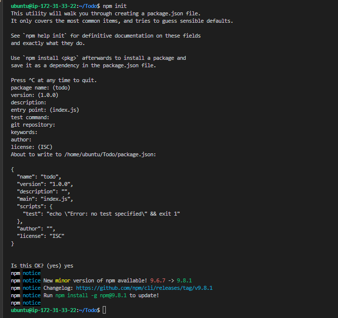

# MERN STACK IMPLEMENTATION

## A SIMPLE TO_DO APPLICATION

BACKEND CONFIGURATION

`sudo apt update`

`sudo apt upgrade`

get the location of Node.js software from Ubuntu repositories

`curl -fsSL https://deb.nodesource.com/setup_18.x | sudo -E bash -`

install nodejs on the server

`sudo apt-get install -y nodejs`

The command above installs both nodejs and npm. NPM is a package manager for Node like apt for Ubuntu, it is used to install Node modules & packages and to manage dependency conflicts

verify node installation

`node -v`

verify node installation

`npm -v`

Application Code Setup
Create a new directory for your To-Do project:

`mkdir Todo`

verify Todo directory has been created

`ls`

change directory to Todo directory

`cd Todo`

Next, you will use the command npm init to initialise your project, so that a new file named package.json will be created. This file will normally contain information about your application and the dependencies that it needs to run. Follow the prompts after running the command. You can press Enter several times to accept default values, then accept to write out the package.json file by typing yes.

`npm init`

Run the command ls to confirm that you have package.json file created

`ls`

### INSTALL expressjs

Remember that Express is a framework for Node.js, therefore a lot of things developers would have programmed is already taken care of out of the box. Therefore it simplifies development, and abstracts a lot of low level details. For example, Express helps to define routes of your application based on HTTP methods and URLs.

`npm install express`

create index.js file

`touch index.js`

`ls`

install the dotenv module

`npm install dotenv`

open index.js file and paste barebones configuration below 

const express = require('express');
require('dotenv').config();

const app = express();

const port = process.env.PORT || 5000;

app.use((req, res, next) => {
res.header("Access-Control-Allow-Origin", "\*");
res.header("Access-Control-Allow-Headers", "Origin, X-Requested-With, Content-Type, Accept");
next();
});

app.use((req, res, next) => {
res.send('Welcome to Express');
});

app.listen(port, () => {
console.log(`Server running on port ${port}`)
});

`vim index.js`

start server to see if it works

`node index.js`

