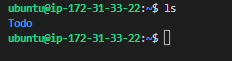
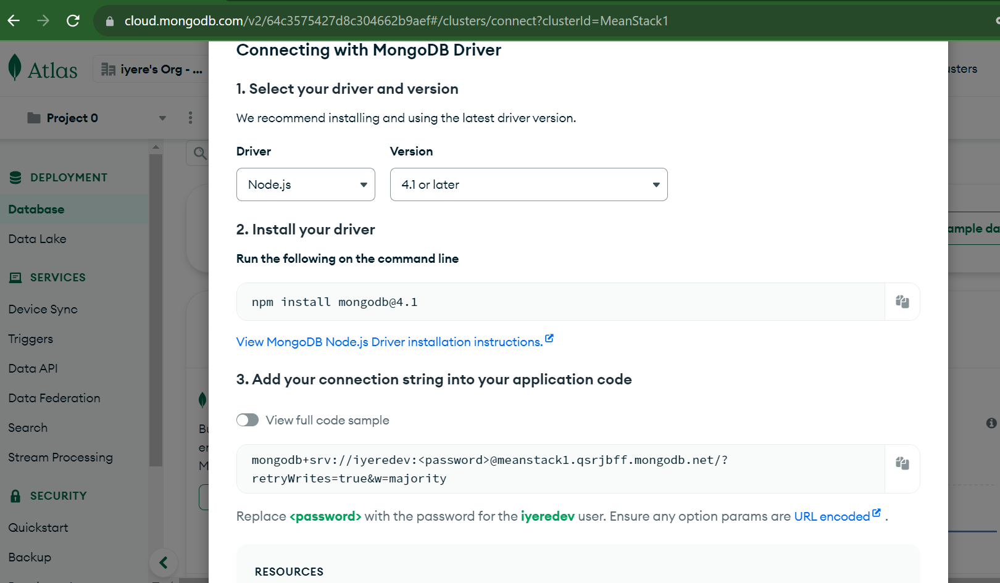

# MERN STACK IMPLEMENTATION

## A SIMPLE TO_DO APPLICATION

BACKEND CONFIGURATION

`sudo apt update`

`sudo apt upgrade`

get the location of Node.js software from Ubuntu repositories

`curl -fsSL https://deb.nodesource.com/setup_18.x | sudo -E bash -`

install nodejs on the server

`sudo apt-get install -y nodejs`

The command above installs both nodejs and npm. NPM is a package manager for Node like apt for Ubuntu, it is used to install Node modules & packages and to manage dependency conflicts

verify node installation

`node -v`

verify node installation

`npm -v`

Application Code Setup
Create a new directory for your To-Do project:

`mkdir Todo`

verify Todo directory has been created

`ls`

change directory to Todo directory

`cd Todo`

Next, you will use the command npm init to initialise your project, so that a new file named package.json will be created. This file will normally contain information about your application and the dependencies that it needs to run. Follow the prompts after running the command. You can press Enter several times to accept default values, then accept to write out the package.json file by typing yes.

`npm init`

Run the command ls to confirm that you have package.json file created

`ls`

### INSTALL expressjs

Remember that Express is a framework for Node.js, therefore a lot of things developers would have programmed is already taken care of out of the box. Therefore it simplifies development, and abstracts a lot of low level details. For example, Express helps to define routes of your application based on HTTP methods and URLs.

`npm install express`

create index.js file

`touch index.js`

`ls`

install the dotenv module

`npm install dotenv`

open index.js file and paste barebones configuration below 

const express = require('express');
require('dotenv').config();

const app = express();

const port = process.env.PORT || 5000;

app.use((req, res, next) => {
res.header("Access-Control-Allow-Origin", "\*");
res.header("Access-Control-Allow-Headers", "Origin, X-Requested-With, Content-Type, Accept");
next();
});

app.use((req, res, next) => {
res.send('Welcome to Express');
});

app.listen(port, () => {
console.log(`Server running on port ${port}`)
});

`vim index.js`

start server to see if it works

`node index.js`

edit inbound rules in AWS console and open port 5000

Open up your browser and try to access your server’s Public IP or Public DNS name followed by port 5000

[opening page in browser](http://3.74.161.53:5000/)

Routes
There are three actions that our To-Do application needs to be able to do:

Create a new task
Display list of all tasks
Delete a completed task
Each task will be associated with some particular endpoint and will use different standard HTTP request methods: POST, GET, DELETE.

For each task, we need to create routes that will define various endpoints that the To-do app will depend on. So let us create a folder routes

`mkdir routes`

change to routes directory

`cd routes`

create a file api.js

`touch api.js`

open api.js file with vim and paste configuration below

const express = require ('express');
const router = express.Router();

router.get('/todos', (req, res, next) => {

});

router.post('/todos', (req, res, next) => {

});

router.delete('/todos/:id', (req, res, next) => {

})

module.exports = router;

`vim api.js`

MODELS

Now comes the interesting part, since the app is going to make use of Mongodb which is a NoSQL database, we need to create a model.

A model is at the heart of JavaScript based applications, and it is what makes it interactive.

We will also use models to define the database schema . This is important so that we will be able to define the fields stored in each Mongodb document. (Seems like a lot of information, but not to worry, everything will become clear to you over time. I promise!!!)

In essence, the Schema is a blueprint of how the database will be constructed, including other data fields that may not be required to be stored in the database. These are known as virtual properties

To create a Schema and a model, install mongoose which is a Node.js package that makes working with mongodb easier.

Change directory back Todo folder with cd .. and install Mongoose

`cd ..`

`npm install mongoose`

create a new folder called models

`mkdir models`

change to models directory

`cd models`

Inside the models folder, create a file and name it todo.js

`touch todo.js`

Open the file created with vim todo.js then paste the code below in the file:

const mongoose = require('mongoose');
const Schema = mongoose.Schema;

//create schema for todo
const TodoSchema = new Schema({
action: {
type: String,
required: [true, 'The todo text field is required']
}
})

//create model for todo
const Todo = mongoose.model('todo', TodoSchema);

module.exports = Todo;

`vim todo.js`

Now we need to update our routes from the file api.js in ‘routes’ directory to make use of the new model.

In Routes directory, open api.js with vim api.js, delete the code inside with :%d command and paste there code below into it then save and exit

const express = require ('express');
const router = express.Router();
const Todo = require('../models/todo');

router.get('/todos', (req, res, next) => {

//this will return all the data, exposing only the id and action field to the client
Todo.find({}, 'action')
.then(data => res.json(data))
.catch(next)
});

router.post('/todos', (req, res, next) => {
if(req.body.action){
Todo.create(req.body)
.then(data => res.json(data))
.catch(next)
}else {
res.json({
error: "The input field is empty"
})
}
});

router.delete('/todos/:id', (req, res, next) => {
Todo.findOneAndDelete({"_id": req.params.id})
.then(data => res.json(data))
.catch(next)
})

module.exports = router;

`vim api.js`

MONGODB DATABASE

We need a database where we will store our data. For this we will make use of mLab. mLab provides MongoDB database as a service solution (DBaaS), so to make life easy, you will need to sign up for a shared clusters free account, which is ideal for our use case. Sign up here. Follow the sign up process, select AWS as the cloud provider, and choose a region near you.

allow access to mongodb database from anywhere (not secure, but ideal for testing) and change time for entry to be deleted from 6 hours to 1 week

In the index.js file, we specified process.env to access environment variables, but we have not yet created this file. So we need to do that now.

Create a file in your Todo directory and name it .env

`touch .env`

Add the connection string to access the database in it, just as below:

DB = 'mongodb+srv://<username>:<password>@<network-address>/<dbname>?retryWrites=true&w=majority'
Ensure to update <username>, <password>, <network-address> and <database> according to your setup

Get your connection string from your mongodb account

first install driver 

`npm install mongodb@4.1`

connection string:   mongodb+srv://iyeredev:<password>@meanstack1.qsrjbff.mongodb.net/?retryWrites=true&w=majority

Replace <password> with the password for the iyeredev user

connection string:   mongodb+srv://iyeredev:<HappyKonga>@meanstack1.qsrjbff.mongodb.net/?retryWrites=true&w=majority

at this point, open .env file and add connection string

Now we need to update the index.js to reflect the use of .env so that Node.js can connect to the database.

Simply delete existing content in the file, and update it with the entire code below:

const express = require('express');
const bodyParser = require('body-parser');
const mongoose = require('mongoose');
const routes = require('./routes/api');
const path = require('path');
require('dotenv').config();

const app = express();

const port = process.env.PORT || 5000;

//connect to the database
mongoose.connect(process.env.DB, { useNewUrlParser: true, useUnifiedTopology: true })
.then(() => console.log(`Database connected successfully`))
.catch(err => console.log(err));

//since mongoose promise is depreciated, we overide it with node's promise
mongoose.Promise = global.Promise;

app.use((req, res, next) => {
res.header("Access-Control-Allow-Origin", "\*");
res.header("Access-Control-Allow-Headers", "Origin, X-Requested-With, Content-Type, Accept");
next();
});

app.use(bodyParser.json());

app.use('/api', routes);

app.use((err, req, res, next) => {
console.log(err);
next();
});

app.listen(port, () => {
console.log(`Server running on port ${port}`)
});

`vim index.js`

Using environment variables to store information is considered more secure and best practice to separate configuration and secret data from the application, instead of writing connection strings directly inside the index.js application file.

Start your server using the command: node index.js

`node index.js`

I encountered an error here. Solution is to open index.js file and change the port from 5000 to 5001. Then on the security group, open port 5001

